# ReadMe - Project 2 (Tumble Teller)

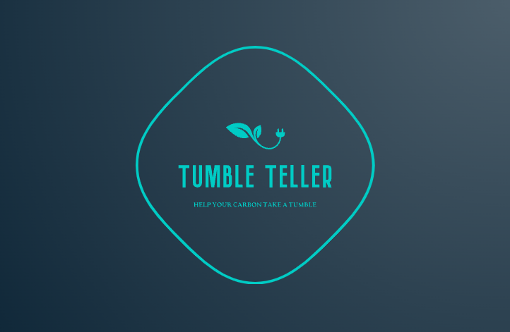
** **

## Description

This project was undertaken in week 6 of the course at the end of the introduction to React module.

The brief was to utilise a public API It was written in React, JavaScript, & Sass.

Researching [public APIs](https://apilist.fun/), I went into the “Help fix the climate” section and found an interesting API that outlined how carbon intensive one’s local power grid in the UK was running based on the split of carbon-emitting vs. carbon-neutral sources that were being used at that moment and over the coming days. I combined this with a public weather API & some logic within JavaScript  to make a recommendation as to whether or not the site user should use their Tumble Dryer or line dry outside based on current carbon intensity and weather conditions.

## [Deployment link](https://tumbleteller.netlify.app/)

The app is hosted on Netifly.

## Getting Started/Code Installation 

1. [GitHub Repo](https://github.com/philiphart1006/classical-tetris) >> 
2. Download directory >> 
3. npm install 
    1. [additional dependencies: axios, react-router-dom, react, react-bootstrap, sass]
4. npm run dev
5. Open local host in local browser

    ``npm i ``

    ``npm run dev``

## Timeframe & Working Team (Solo/Pair/Group) 

This project was undertaken as a solo effort over the course of 2 days: Wednesday afternoon - Friday morning.

## Technologies Used

* Tooling
    * Vite
    * Axios
* Styling
    * CSS
    * Sass
    * Bootstrap
    * React-Bootstrap
* Functionality
    * JavaScript
    * React
    * React-Router-Dom
* External sources
    * REST APIs

## Brief

### Overview

​The second project is to build a React application that consumes a public API in a short, two-day, timeframe.

### Technical Requirements

​Your app must:​

* Consume a public API – this could be anything but it must make sense for your project.
* Have several components
* The app can have a router - with several "pages", this is up to you and if it makes sense for your project.
* Include wireframes - that you designed before building the app.
* Be deployed online and accessible to the public (hosted on your public github, not GA github!)​

### Necessary Deliverables

* A working application, hosted somewhere on the internet
* A link to your hosted working app in the URL section of your Github repo
* A git repository hosted on Github, with a link to your hosted project, and frequent commits dating back to the very beginning of the project
* A readme.md file with:
    * Explanations of the technologies used
    * A couple of paragraphs about the general approach you took
    * Installation instructions for any dependencies
    * Link to your wireframes – sketches of major views / interfaces in your application
    * Descriptions of any unsolved problems or major hurdles your team had to overcome​

## Planning

### Project management

Once again using a template Trello board, I split the application functionality and coding into separate _user stories_. I also included columns for bugs & enhancements. This helped me pseudocode & split out functionality into different components.

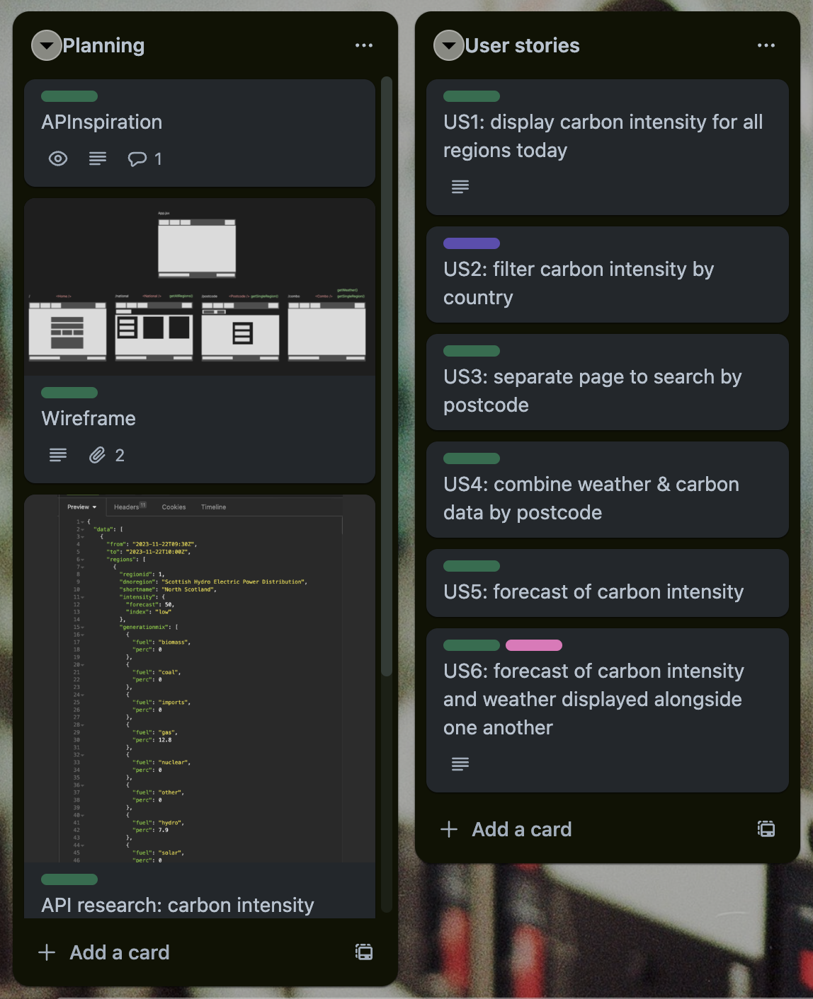

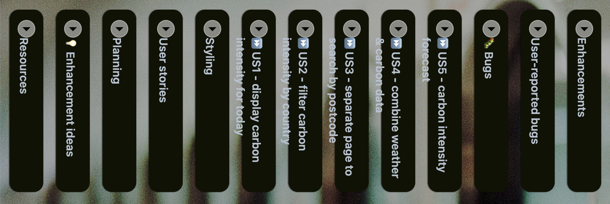

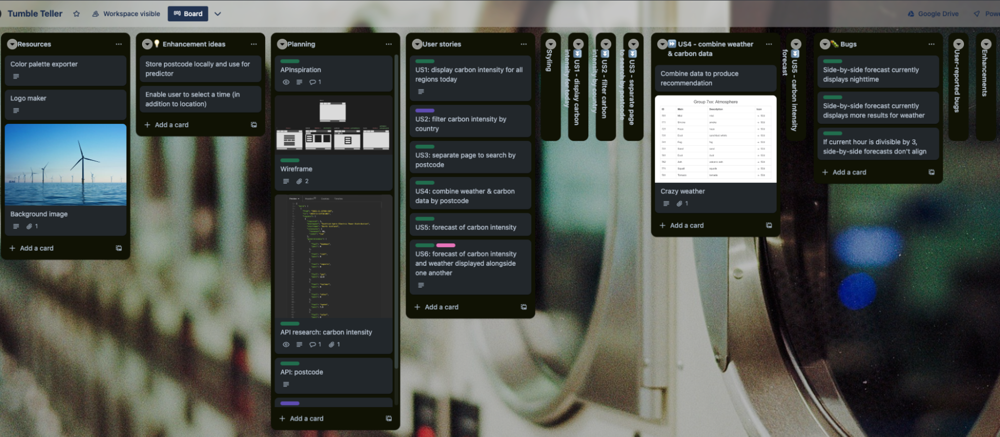

### Design

#### Wireframe

I utilised Figma here to draw out the wireframes with all HTML elements. Grouping elements, I was able to map out the pages with their relevant paths, components, loaders, and/or actions.

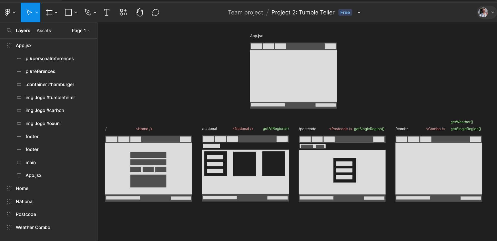

#### Resources

I utilised various licence-free sites for resources such as images & AI-generated logos/favicons.

### APIs

#### [Carbonintensity.org.uk](https://carbonintensity.org.uk/)

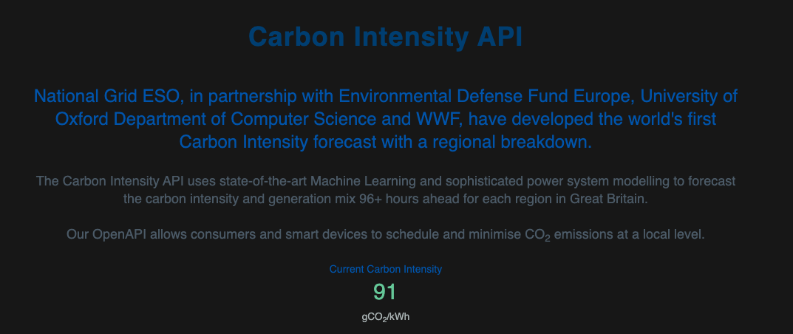

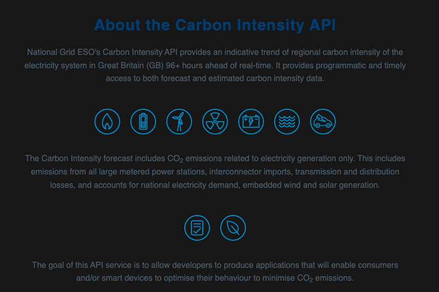

#### [OpenWeather](https://openweathermap.org/)

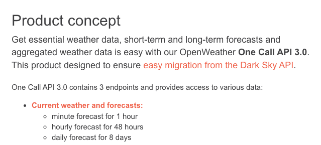

## Build/Code Process

_N.B. Coding snippets & highlights can be found outlined in further detail in Wins/Challenges/Key Learnings._

#### Day 1 (pm)

* Setup directory - created with Vite and manually expanded
* Created global components: footer, nav
* Create four pages: home, national, postcode, & combo

#### Day 2

* Add base styling using Sass
* Hides OpenWeather API’s secret key within an .env file variable that has been added to .gitignore file too
* Complete “Tumble Teller Recommendation” user story (see “Wins”)
* Create 3 hourly side-by-side forecast for carbon intensity & weather

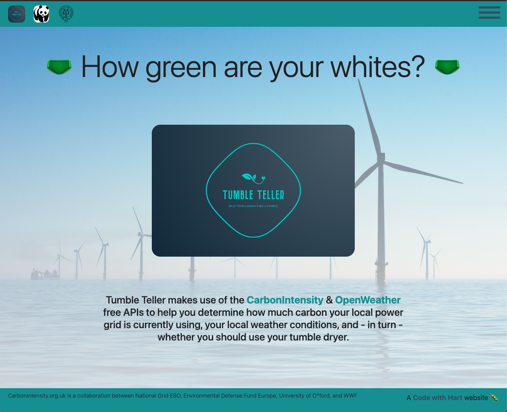

#### Day 3 (am)

* Add bug tracker & tailored error page for fetch error
* Add more commentary and consistent formatting throughout code
* Attempt unsuccessfully to re-factor the multi-API request function

## Challenges

#### Combining React & Bootstrap elements

I wanted to utilise the Form element from both React and, for styling, React-Bootstrap. I could import them with different names; however, as soon as I changed the &lt;input> element to a React Bootstrap element, the useActionData() stopped working.

Going forward, I would like to try and make more use of React Bootstrap for styling.

## Wins

#### Combo Components

In order to make the actual Tumble Teller recommendation, I had to send off two GET requests from different APIs.

In order to do this, I had one getCombo() action that extracted the postcode from the formData then called both functions within carbon.js

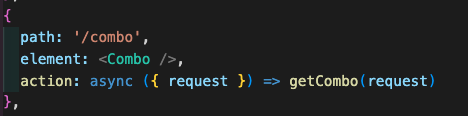

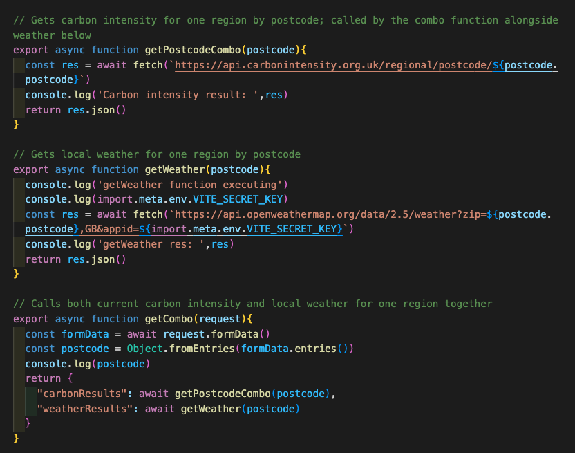

Within the component, I then created a chunk of conditional logic that compared both weather and carbon intensity data and made a recommendation based on set parameters.

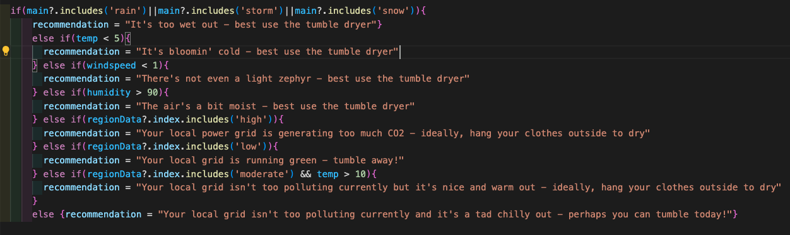

Visually, I also used conditional formatting with the same parameters to allow visual comparison based on red/amber/green.

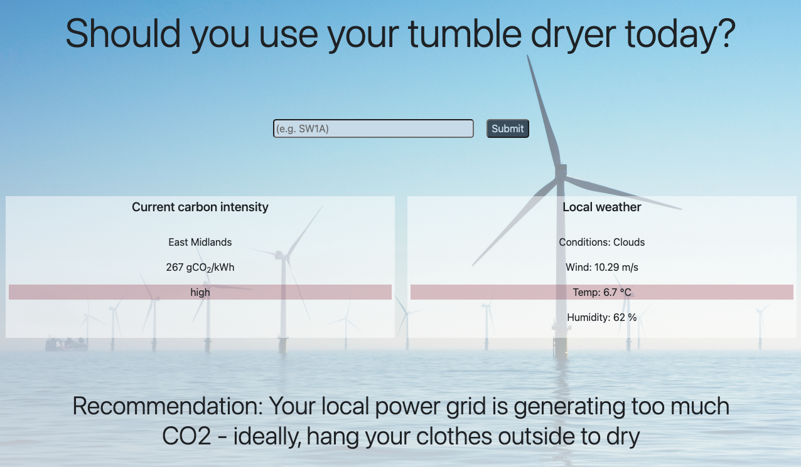

## Key Learnings/Takeaways

#### Styling

While the majority of styling was created within Sass files that were imported into main.scss, this was my first foray into using (React) Bootstrap for some parts too such as the nav modal and responsive text sizing.

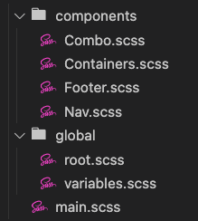

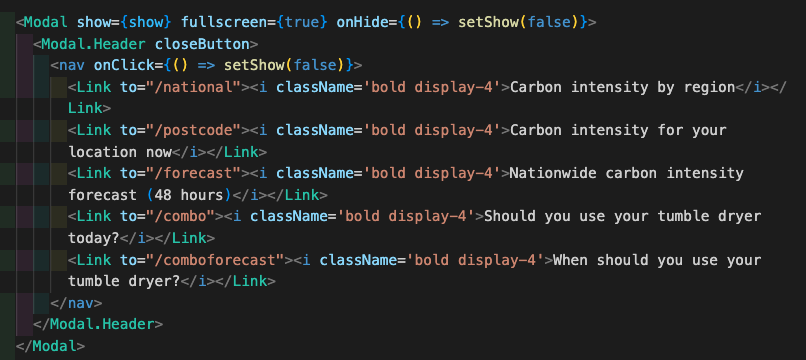

#### React components & routers

This was my first multi-page build and made use of the installed react-router-dom package. While keeping some elements across the application constant such as the header/nav and footer, I was able to change out the central &lt;outlet> with different sub-pages.

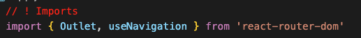

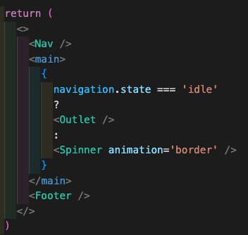

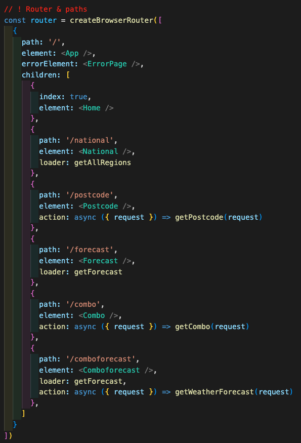

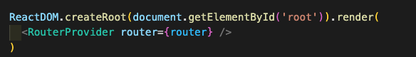

#### Committing

By using comprehensive messaging within my commits, I am able to easily look back and identify fairly approximately what code I would have added/modified at each step.

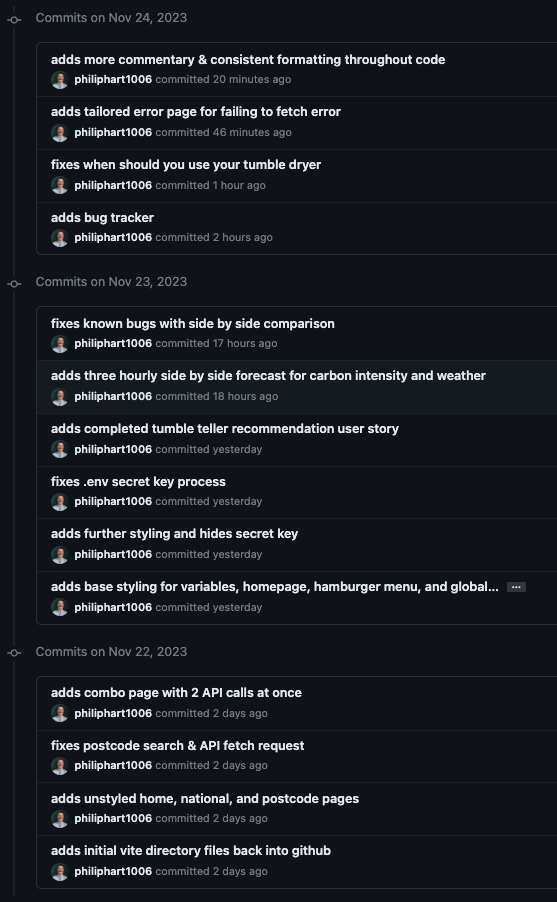

## Bugs

#### Resolved bugs

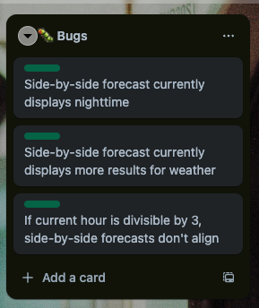

#### Unresolved bugs

_Watch this space! Player reported bugs will appear via [this form](https://forms.gle/JGBjrefy6AckNK8BA)_. This is implanted in the footer of the application to allow users to report bugs. Zapier automation would add a new card with these details to the user-reported bugs Trello list.

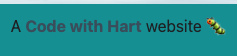

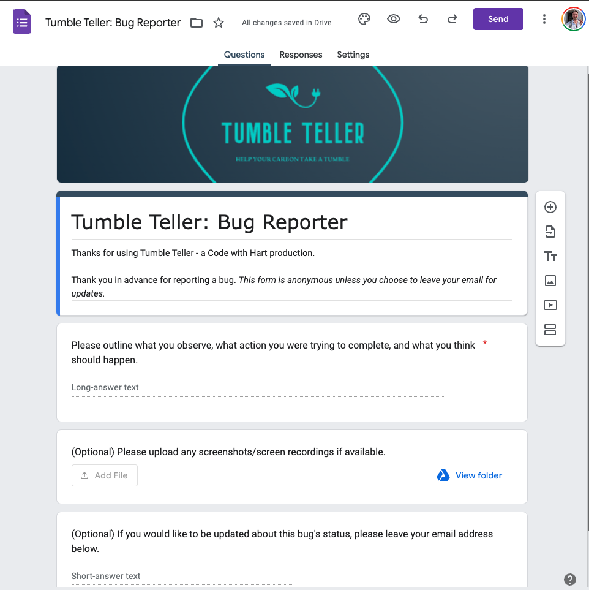

## Future Improvements

#### Remaining desired enhancements

It would be good to have multiple inputs on the form to allow a user to select: day/time if not current, how environmentally minded they’d like the recommendations to be.
